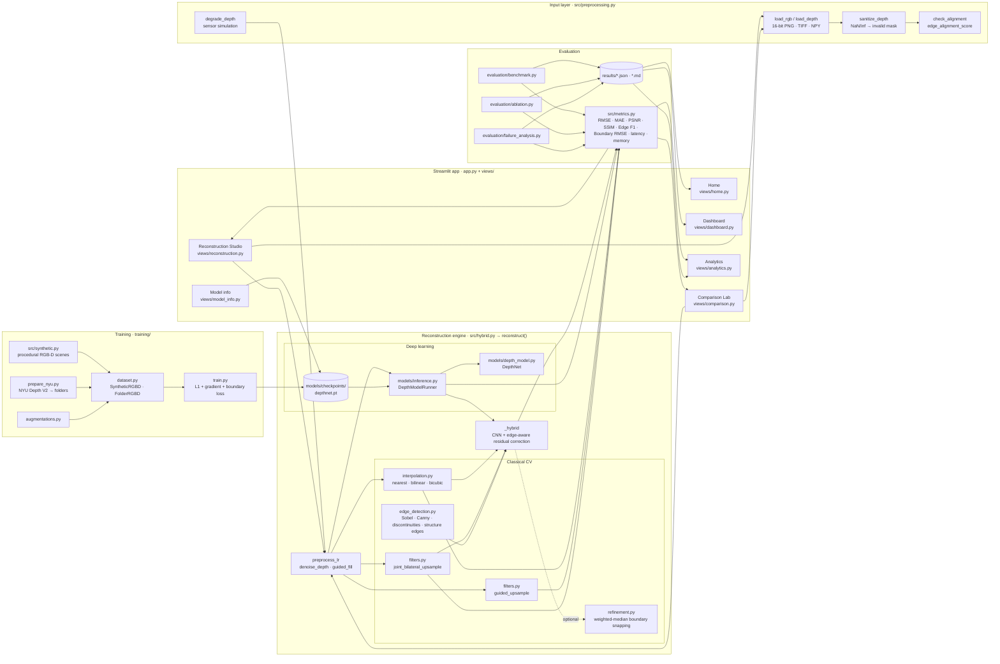
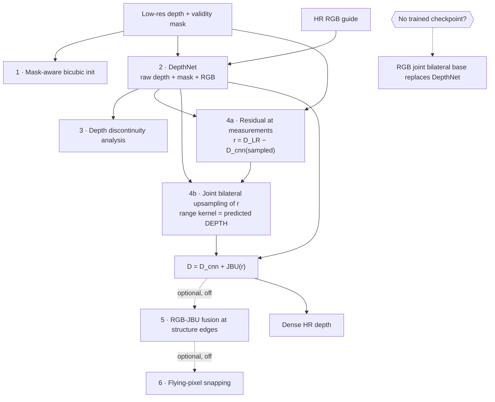
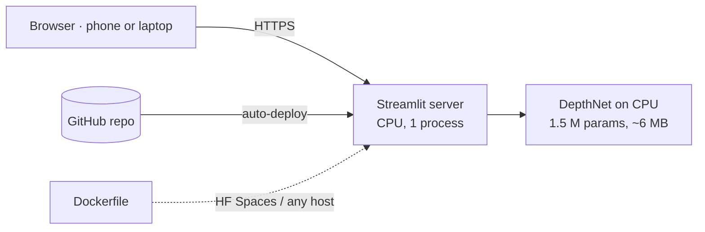

# DEPTHMAP AI — System Architecture

The diagram matches the code: every box names the file that implements it.

```mermaid
flowchart LR
    subgraph UI["Streamlit app · app.py + views/"]
        H[Home<br/>views/home.py]
        D[Dashboard<br/>views/dashboard.py]
        S[Reconstruction Studio<br/>views/reconstruction.py]
        C[Comparison Lab<br/>views/comparison.py]
        A[Analytics<br/>views/analytics.py]
        M[Model info<br/>views/model_info.py]
    end

    subgraph IN["Input layer · src/preprocessing.py"]
        L1[load_rgb / load_depth<br/>16-bit PNG · TIFF · NPY]
        L2[sanitize_depth<br/>NaN/inf → invalid mask]
        L3[check_alignment<br/>edge_alignment_score]
        L4[degrade_depth<br/>sensor simulation]
    end

    subgraph ENGINE["Reconstruction engine · src/hybrid.py → reconstruct()"]
        P[preprocess_lr<br/>denoise_depth · guided_fill]
        subgraph CL["Classical CV"]
            I[interpolation.py<br/>nearest · bilinear · bicubic]
            G[filters.py<br/>guided_upsample]
            J[filters.py<br/>joint_bilateral_upsample]
            E[edge_detection.py<br/>Sobel · Canny · discontinuities · structure edges]
            R[refinement.py<br/>weighted-median boundary snapping]
        end
        subgraph DL["Deep learning"]
            N[models/inference.py<br/>DepthModelRunner]
            NN[models/depth_model.py<br/>DepthNet]
            CK[(models/checkpoints/<br/>depthnet.pt)]
        end
        HY[_hybrid<br/>CNN + edge-aware residual correction]
    end

    subgraph EV["Evaluation"]
        MT[src/metrics.py<br/>RMSE · MAE · PSNR · SSIM · Edge F1 · Boundary RMSE · latency · memory]
        BM[evaluation/benchmark.py]
        AB[evaluation/ablation.py]
        FA[evaluation/failure_analysis.py]
        RS[(results/*.json · *.md)]
    end

    subgraph TR["Training · training/"]
        SY[src/synthetic.py<br/>procedural RGB-D scenes]
        DS[dataset.py<br/>SyntheticRGBD · FolderRGBD]
        AU[augmentations.py]
        TT[train.py<br/>L1 + gradient + boundary loss]
        NY[prepare_nyu.py<br/>NYU Depth V2 → folders]
    end

    S & C --> L1 --> L2 --> L3
    S & C --> P
    L4 --> P
    P --> I & G & J & N
    N --> NN
    CK --> N
    I --> HY
    N --> HY
    J --> HY
    E --> HY
    HY -.optional.-> R
    HY --> MT
    I & G & J & N --> MT
    MT --> S & C & A
    BM & AB & FA --> MT
    BM & AB & FA --> RS --> A & D & H
    SY --> DS
    NY --> DS
    AU --> DS --> TT --> CK
    M --> CK
```

## Hybrid pipeline (detail)

```mermaid
flowchart TD
    LR[Low-res depth + validity mask] --> BI[1 · Mask-aware bicubic init]
    LR --> CNN[2 · DepthNet<br/>raw depth + mask + RGB]
    RGB[HR RGB guide] --> CNN
    CNN --> ED[3 · Depth discontinuity analysis]
    CNN --> RS["4a · Residual at measurements<br/>r = D_LR − D_cnn(sampled)"]
    LR --> RS
    RS --> JB["4b · Joint bilateral upsampling of r<br/>range kernel = predicted DEPTH"]
    CNN --> JB
    JB --> ADD["D = D_cnn + JBU(r)"]
    CNN --> ADD
    ADD -.optional, off.-> F5[5 · RGB-JBU fusion at structure edges]
    F5 -.optional, off.-> F6[6 · Flying-pixel snapping]
    ADD --> OUT[Dense HR depth]
    NOCK{{No trained checkpoint?}} -.-> JBASE[RGB joint bilateral base replaces DepthNet]
```

## Runtime & deployment

```mermaid
flowchart LR
    U[Browser · phone or laptop] -->|HTTPS| ST[Streamlit server<br/>CPU, 1 process]
    ST --> MOD[DepthNet on CPU<br/>1.5 M params, ~6 MB]
    GH[(GitHub repo)] -->|auto-deploy| ST
    DK[Dockerfile] -.->|HF Spaces / any host| ST
```
